성폭력 민감도에 따른 성역할 인식 - 성폭력 민감도에 영향을 미치는 요인을 중심으로
================

1. 초록
-------

본 분석연구에서는 '성폭력 민감도에 영향을 미치는 요인'은 어떤 것이 있는지 분석하였다. 따라서 본 주제를 통해서 총 5가지 종류의 변수들 간의 상관관계를 알고자하였고, 결과는 다음과 같다. 첫 번째, 성폭력 민감도에 따른 성역할 인식의 경우, 성폭력 민감도가 낮은 집단이 성폭력 민감도가 높은 집단보다 성역할 인식이 높은 경향이 나타났다. 두 번째, 부모님의 학력에 따른 성폭력 민감도의 경우, 부모님의 학력수준이 높아짐에 따라 성폭력 인식이 높다고 분류되는 여성도 많아졌다. 세 번째, 15세 무렵 성장 배경에 따른 성폭력 민감도의 경우, 성폭력에 민감한 대부분의 응답자는 15세 무렵 부모님과의 관계가 좋은 편이라는 것을 알 수 있었다. 또한, 15세 무렵 부모님의 양육태도가 엄격하지 않으면, 자녀의 성폭력 민감도가 높아진다는 사실을 알 수 있었다. 네 번째, 성폭력 민감도에 따른 부부생활에서의 생 생활 가치 중요도의 경우, 성 생활에 대한 가치 중요도는 성폭력 민감도와 비례관계를 나타냈다. 마지막으로 성폭력 민감도에 따른 경제적 결정권 인식의 경우, 성폭력민감도가 높은 사람들이 남성이 경제적 결정권의 주체가 되는 것에 반대하는 성향이 더 높다는 것을 알 수 있었다. 첫 번째와 마지막 분석을 통해서는 성폭력 민감도가 영향을 미치는 대상을 알 수 있었고, 두 번째부터 네 번째 분석은 성폭력 민감도가 영향을 받는 요소를 밝혀내는 분석이었다.

2. 분석 주제
------------

성폭력은 단지 불특정타자와의 일이라고 인식될 수 있으나, 연인관계나 부부관계에서도 발생할 수 있을 정도로 두루 퍼져 있다. 이처럼 사랑 및 부부생활에 있어서 '성'이 중요한 가치 중 하나이므로, ‘성폭력’에 대한 인식과 '성역할'에 대한 인식이 어떤 관계성을 띠는지 분석하고자 한다. 또한, 성폭력 민감도가 영향을 받는 요소와 영향을 주는 요소는 어떤 것이 있는지 분석하고자 한다. 위와 같은 분석과정을 거친 본 연구를 통해, 한국 사회 내에서 성폭력과 관련된 인식의 원인을 알아봄으로써, 성 관련 인식 분야에서 개선해야 할 방향을 알 수 있을 것이다.

3.데이터 선정
-------------

성폭행에 대한 민감도와 성역할 인식의 관계를 큰 주제로 잡고, 성폭력을 합리화하는 여러 질문 항목들에 대한 답변에 대해 ‘성폭력 민감도’가 높은 범주에 속하도록 하고, 그 반대는 낮은 범주에 속하도록 한다. 독립변수는 성폭행에 대한 민감도를 계량화할 수 있는 질문(남자가 술을 마시고하는 성적행동은 실수로 용납될 수 있다, 배우자의 폭력은 빈번하지않으면 참고 넘어갈 수 있다 등)을 찾고 이에 따라 여성이 생각하는 성역할 인식의 개인 차이가 있을 수 있다고 생각하여 그것을 계량화 할 수 있는 질문인 ‘사회에서 중요한 일을 추진하는 것은 주로 남자의 역할’을 종속변수로 선정하였다. 사회적인 통념,혹은 일반적으로 생각할 수 있는 변수가 아닌 흥미로운 상관관계를 내기 위해 독립변수에 영향을 미치는 요소(15세 무렵 동거한 아버지,어머니의 최종학력과 같은 시기의 가정의 경제형편)를 선정하였고 종속변수를 대체할 수 있는 다른 질문(부부생활 성적 만족도, 경제적 결정권의 주체에 대한 인식)을 찾아서 추가적으로 분석하였다. 우선, ‘성장배경’과 관련된 여러 변수들과의 관계, '부부 생활 중 성적 만족도' 변수와의 관계를 알아본 뒤,결론적으로 ‘성폭력민감도’에 따라 ‘성역할인식’이 뚜렷한지 아닌지의 척도를 알아보고자 한다. 나아가 성폭력 민감도에 따른 경제적 결정권 인식을 알아보고자 한다.

------------------------------------------------------------------------

-   데이터 출처 : 여성가족패널, <http://klowf.kwdi.re.kr/>, '1-6차년도 데이터(180503)\_SPSS'

### 3.1.데이터 전처리

#### 3.1.1. 사용할 함수 불러오기

``` r
library(dplyr)
library(readxl)
library(ggplot2)
library(gridExtra)
```

#### 3.1.2.multiplot 사용준비

``` r
multiplot <- function(..., plotlist=NULL, file, cols=1, layout=NULL) {
  require(grid)
  plots <- c(list(...), plotlist)
  numPlots = length(plots)
  if (is.null(layout)) {
    layout <- matrix(seq(1, cols * ceiling(numPlots/cols)),
                     ncol = cols, nrow = ceiling(numPlots/cols))
  }
  if (numPlots==1) {
    print(plots[[1]])
  } else {
    grid.newpage()
    pushViewport(viewport(layout = grid.layout(nrow(layout), ncol(layout))))
    for (i in 1:numPlots) {
      matchidx <- as.data.frame(which(layout == i, arr.ind = TRUE))
      print(plots[[i]], vp = viewport(layout.pos.row = matchidx$row,
                                      layout.pos.col = matchidx$col))
    }
  }
}
```

#### 3.1.3. 불러오기

``` r
raw_panel <- read_excel("klowf06np(180503).xlsx")
panel <- raw_panel #원본 데이터 변형을 방지하기 위해 복사본 생성
```

#### 3.1.4. 변수선택 및 이름바꾸기

``` r
#분석에 사용할 변수 선택
data <- panel %>%
  select(NP629SH03, NP629SH04, NP629SH05, NP629SH06, NP629SH07, NP629SH08, NP627GC01, NP6011518, NP6011508, NP6011509, NP6011506, NP6011510, NP627GC05, NP627FV12)

#이해하기 쉬운 이름으로 수정
data <- rename(data,
               var3 = NP629SH03, 
               var4 = NP629SH04,
               var5 = NP629SH05,
               var6 = NP629SH06,
               var7 = NP629SH07,
               var8 = NP629SH08,
               gen = NP627GC01,
               eco = NP6011518,
               par1 = NP6011508,
               par2 = NP6011509,
               m_edu = NP6011506,
               f_edu = NP6011510,
               e_dec = NP627GC05,
               dec = NP627GC05,
               satis = NP627FV12)
```

#### 3.1.5. 변수 생성

``` r
#척도 분석을 위해 역코딩
data <- data %>%
  mutate(gen = 5-gen,
         eco = 6-eco,
         par1 = 7-par1,
         satis = 5-satis)

#민감도가 높은 사람과 낮은 사람으로 분류
data <- data %>%
  mutate(sens_std = 0,
         sens_std = ifelse(var3 == 4, sens_std + 1, sens_std),
         sens_std = ifelse(var4 == 4, sens_std + 1, sens_std),
         sens_std = ifelse(var5 == 4, sens_std + 1, sens_std),
         sens_std = ifelse(var6 == 4, sens_std + 1, sens_std),
         sens_std = ifelse(var7 == 4, sens_std + 1, sens_std),
         sens_std = ifelse(var8 == 4, sens_std + 1, sens_std),
         sens_std = ifelse(var3 == 3, sens_std + 0.5, sens_std),
         sens_std = ifelse(var4 == 3, sens_std + 0.5, sens_std),
         sens_std = ifelse(var5 == 3, sens_std + 0.5, sens_std),
         sens_std = ifelse(var6 == 3, sens_std + 0.5, sens_std),
         sens_std = ifelse(var7 == 3, sens_std + 0.5, sens_std),
         sens_std = ifelse(var8 == 3, sens_std + 0.5, sens_std),
         sensitivity_4 = ifelse(sens_std >=5, "sens_high", "sens_low"),
         sensitivity = sensitivity_4)

#학력을 4단계로 분류
data <- data %>%
  mutate(m_edu = ifelse(m_edu == 1, "1no_edu",
                        ifelse(m_edu <= 4, "2require",
                               ifelse(m_edu <= 6, "3high", "4sup_high")))) %>% 
  mutate(f_edu = ifelse(f_edu == 1, "1no_edu",
                        ifelse(f_edu <=4, "2require",
                               ifelse(f_edu <= 6, "3high", "4sup_high"))))
```

### 3.2. 변수 설명

#### 3.2.1. 기본 변수 설명

-   var3 ~ 7 : 성폭력 인식에 관한 변수로, 질문에 대해 1(매우 그렇다), 2(조금 그렇다), 3(별로 그렇지 않다), 4(전혀 그렇지 않다)로 응답 받은 변수이다.(아래는 각 질문의 내용이다.)
-   var3 : 노출이 심한 옷을 입은 상태에서 성폭력을 당했다면 여자에게도 책임이 있다.
-   var4 : 남자가 술을 마시고 하는 성적 행동은 실수로 용납될 수 있다.
-   var5 : 성폭력을 줄이기 위해서 성매매는 필요하다.
-   var6 : 사회생활을 하다보면 어쩔 수 없이 성매매를 할 수 있다.
-   var7 : 배우자의 폭력은 빈번하지 않으면 참고 넘어갈 수 있다.
-   var8 : 배우자가 원치 않는 성관계를 요구해도 받아들여야 한다.
-   gen : 성역할 인식에 관한 변수로, "사회에서 중요한 일을 추진하는 것은 주로 남자의 역할"이라는 질문에 1(매우 그렇다), 2(조금 그렇다), 3(별로 그렇지 않다), 4(전혀 그렇지 않다)로 응답 받은 변수이다. 전처리를 통해 각각 4, 3, 2, 1 번으로 수정하였다.
-   eco : 15세 이전 가정의 경제적 형편에 관한 변수로, 1(아주 잘 사는 편이었다), 2(대체로 잘 사는 편이었다), 3(보통이었다), 4(대체로 어려운 편이었다), 5(아주 어려운 편이었다)로 응답받은 변수이다. 전처리를 통해 각각 5, 4, 3, 2, 1번으로 수정하였다.
-   par1 : 15세 무렵 부모님과의 관계와 관련된 변수로, 1(아주 좋은 편이었다), 2(대체로 좋은 편이었다), 3(보통이었다), 4(별로 좋지 않은 편이었다), 5(매우 좋지 않은 편이었다), 6(해당사항없음)으로 응답받은 변수이다. 전처리를 통해 각각 6, 5, 4, 3, 2, 1번으로 수정하였다.
-   par2 : 15세 무렵 부모님의 양육태도와 관련된 변수로, 1(아주 엄격한 편이었다), 2(대체로 엄격한 편이었다), 3(보통이었다), 4(별로 엄격하지 않은 편이었다), 5(전혀 엄격하지 않은 편이었다), 6(해당사항없음)으로 응답받은 변수이다.
-   m\_edu : 15세 이전 동거했던 어머니의 학력에 관한 변수로, 1(무학), 2(초등학교), 3(중학교), 4(고등학교), 5(전문대학), 6(4년제 대학), 7(대학원 석사), 8(대학원 박사)로 응답받은 변수이다. 본 연구에서는 필요에 따라 전처리를 통해, no\_edu(무학), require(초등학교, 중학교, 고등학교 - 사회적으로 의무교육과정이라고 인식되는 학력), high(전문대학, 4년제 대학 - 고등교육과정), super\_high(대학원 석사, 박사 - 대학원과정)으로 구분하였다.
-   f\_edu : 15세 이전 동거했던 아버지의 학력에 관한 변수로, 어머니의 학력을 구분하는 과정과 같은 방식으로 구분하였다.
-   dec : 추가 분석을 위해 선택한 변수로, 성역할 인식에 관한 변수 중, '가정의 경제적 결정권은 남편이 가져야'라는 질문에 대해 1(매우 그렇다), 2(조금 그렇다), 3(별로 그렇지 않다), 4(전혀 그렇지 않다)로 응답 받은 변수이다.
-   satis : 추가 분석을 위해 선택한 가족 관련 가치관에 관한 변수로, '부부생활에서 성적 만족은 중요'라는 질문에 1(매우 그렇다), 2(조금 그렇다), 3(별로 그렇지 않다), 4(전혀 그렇지 않다)로 응답 받은 변수이다. 전처리를 통해 각각 4, 3, 2, 1 번으로 수정하였다. 성생활 만족에 대한 중요도(satis)는 "부부생활에서 성적 만족은 중요" 라는 질문에 '매우 그렇다(4)' '조금 그렇다(3)' '별로 그렇지 않다(2)', '그렇지 않다(1)' 로 응답 내용을 표시한 것이다. 즉 4에 가까울수록 성생활에 대해서 큰 의미를 두고 있고 1에 가까울수록 그렇지 않다는 것을 의미한다.

#### 3.2.2. 성폭력 민감도 관련 변수 설명

-   sens\_std 변수는 성폭력 민감도에 관련한 질문에 어떻게 대답을 했는지에 따라서 산정되는 변수이다. 수식으로 나타내면 sens\_std = {1 X 4(전혀 그렇지 않다)라고 대답한 수} + {0.5 X 3(약간 그렇지 않다)} 이다. 즉 sens\_std 수치가 높을수록 성폭력 민감도가 높다고 할 수 있다. 즉 sens\_std 의 값의 범주는 0 =&lt; sens\_std =&lt; 6 이다.
-   성폭력 민감도 변수(sensitivity)는 sens\_std 변수를 기준으로 성폭력 민감도가 높다(sens\_high)와 성폭력 민감도가 낮다(sens\_low)로 나뉘게 된다. sens\_std 가 5 이상일 경우 성폭력 민감도가 높음(sens\_high)로 분류되고 5 미만일 경우 성폭력 민감도가 낮음(sens\_low)로 분류된다.
-   성폭력 민감도가 높은 사람(sens\_high) : 332명 중 168명
-   성폭력 민감도가 낮은 사람(sens\_low) : 332명 중 164명

4. 분석
-------

### 4.1. 성폭력 민감도에 따른 성역할 인식

``` r
#민감도가 높은 사람과 그렇지 않은 사람의 분포 알아보기
table(data$sensitivity)
```

    ## 
    ## sens_high  sens_low 
    ##       168       164

``` r
#민감도를 기준으로 성역할 인식의 분포 알아보기
gender_sens <- data %>%
  group_by(sensitivity, gen) %>%
  summarise(n = n()) %>%
  mutate(ratio = n/sum(n)*100)

gender_sens
```

    ## # A tibble: 8 x 4
    ## # Groups:   sensitivity [2]
    ##   sensitivity   gen     n ratio
    ##   <chr>       <dbl> <int> <dbl>
    ## 1 sens_high      1.    48 28.6 
    ## 2 sens_high      2.    88 52.4 
    ## 3 sens_high      3.    28 16.7 
    ## 4 sens_high      4.     4  2.38
    ## 5 sens_low       1.    19 11.6 
    ## 6 sens_low       2.    89 54.3 
    ## 7 sens_low       3.    50 30.5 
    ## 8 sens_low       4.     6  3.66

#### - 그래프

``` r
#x축을 민감도, y축을 비율(성역할 인식과 관련된 비율 포함)로 하는 그래프 생성
graph1 <- ggplot(data = gender_sens, aes(x = sensitivity, y = ratio, fill = gen)) +
  geom_col() +
  coord_flip()

graph1
```

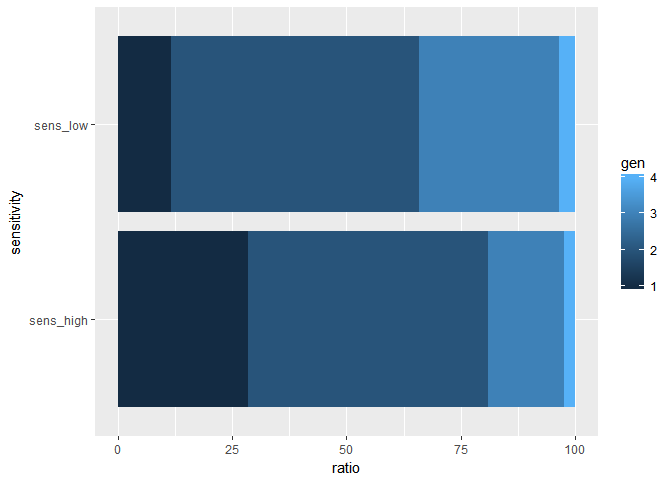

-   graph1은 성폭력 민감도(senitivity)에 따른 성역할 인식(gen)을 비율로 나타낸 그래프이다.
-   성역할 인식 변수 gen 는 "사회적으로 중요한 일은 남자가 맡아야 한다" 라는 질문에 각 '매우 그렇다(4)' '조금 그렇다(3)' '별로 그렇지 않다(2)', '그렇지 않다(1)' 로 응답 내용을 표시한 것이다. 즉 성역할 인식이 강할 수록 4에 가깝고 적을 수록 1에 가깝다.
-   해석 : graph1 에서 성폭력 민감도가 높은 집단(sens\_high)와 성폭력 민감도가 낮은 집단(sens\_low)사이에서 성역할 인식에 대한 응답 중 1과 3에 해당되는 부분의 차이가 두드러지게 나타남을 확인할 수 있다.sens\_high 집단에서 성역할 인식이 높다는 것을 의미하는 응답인 3(조금 그렇다)의 비율이 약 17% 이고 sens\_low 집단에서 해당 비율이 약 30% 이다. 또한 성역할 인식에 대한 응답 중 성역할 인식이 낮음을 의미하는 1(그렇지 않다)에 해당되는 비율이 sens\_high 집단에서는 약 29%, sens\_low 집단에서는 약 12%로 두 배 넘게 차이 남을 알 수 있다. 이러한 극명한 차이에 기저하여 성폭력 민감도가 낮은 집단이 성폭력 민감도가 높은 집단보다 성역할 인식이 높은 경향이 나타남을 알 수 있다.

### 4.2. 성폭력 민감도에 영향을 미치는 요인

#### 4.2.1. 15세 이전 동거했던 부모님의 학력이 성폭력 민감도에 미치는 영향

``` r
#결측치 확인
table(!is.na(data$f_edu))
```

    ## 
    ## FALSE  TRUE 
    ##    10   322

``` r
table(!is.na(data$m_edu))
```

    ## 
    ## TRUE 
    ##  332

##### 4.2.1.1. 아버지의 학력과 성폭력 민감도

``` r
#아버지 학력을 기준으로 민감도 분포 알아보기
gender_sens_f_edu <- data %>%
  filter(!is.na(f_edu)) %>%
  group_by(f_edu, sensitivity) %>%
  summarise(n = n()) %>% 
  mutate(ratio = (n/sum(n)*100))

gender_sens_f_edu
```

    ## # A tibble: 7 x 4
    ## # Groups:   f_edu [4]
    ##   f_edu     sensitivity     n ratio
    ##   <chr>     <chr>       <int> <dbl>
    ## 1 1no_edu   sens_low        3 100. 
    ## 2 2require  sens_high      81  46.3
    ## 3 2require  sens_low       94  53.7
    ## 4 3high     sens_high      74  56.9
    ## 5 3high     sens_low       56  43.1
    ## 6 4sup_high sens_high      10  71.4
    ## 7 4sup_high sens_low        4  28.6

``` r
#x축을 아버지 학력, y축을 비율(성폭력 민감도 비율 포함)로 하는 그래프 생성
graph2_1 <- ggplot(data = gender_sens_f_edu, aes(x = f_edu, y = ratio, fill = sensitivity)) +
  geom_col() +
  coord_flip()

graph2_1
```

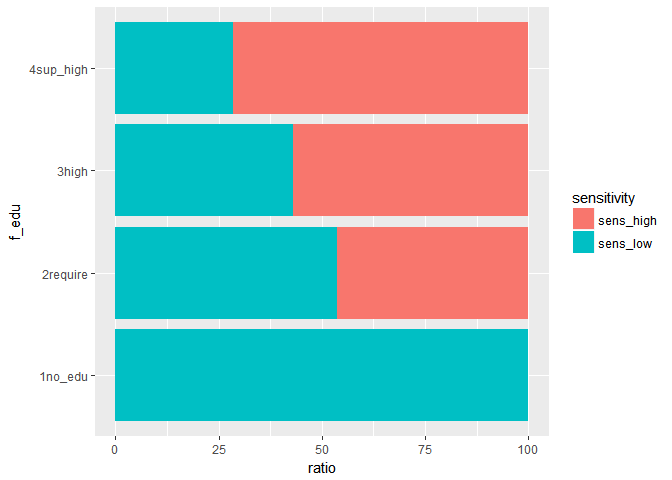

##### 4.2.1.2. 어머니의 학력과 성폭력 민감도

``` r
#어머니 학력을 기준으로 민감도 분포 알아보기
gender_sens_m_edu <- data %>%
  filter(!is.na(m_edu)) %>%
  group_by(m_edu,sensitivity) %>%
  summarise(n = n()) %>% 
  mutate(ratio = (n/sum(n)*100))

gender_sens_m_edu
```

    ## # A tibble: 8 x 4
    ## # Groups:   m_edu [4]
    ##   m_edu     sensitivity     n ratio
    ##   <chr>     <chr>       <int> <dbl>
    ## 1 1no_edu   sens_high       1  16.7
    ## 2 1no_edu   sens_low        5  83.3
    ## 3 2require  sens_high     102  47.0
    ## 4 2require  sens_low      115  53.0
    ## 5 3high     sens_high      63  61.8
    ## 6 3high     sens_low       39  38.2
    ## 7 4sup_high sens_high       2  28.6
    ## 8 4sup_high sens_low        5  71.4

``` r
#x축을 어머니 학력, y축을 비율(성폭력 민감도 비율 포함)로 하는 그래프 생성
graph2_2 <- ggplot(data = gender_sens_m_edu, aes(x = m_edu, y = ratio, fill = sensitivity)) +
  geom_col() +
  coord_flip()

graph2_2
```

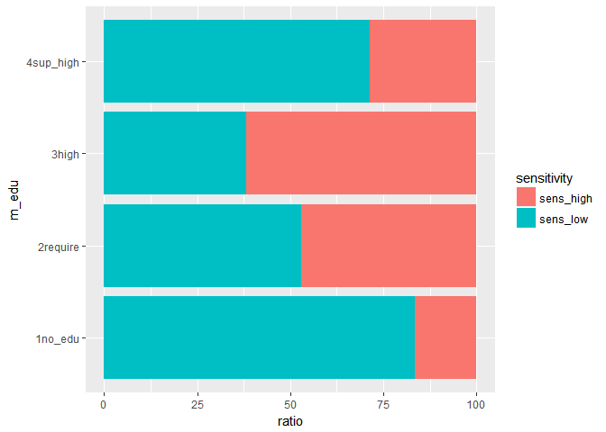

##### - 그래프

``` r
#multiplot을 통해 아버지 통계 그래프, 어머니 통계 그래프 비교
multiplot(graph2_1, graph2_2, cols = 1)
```

    ## Loading required package: grid

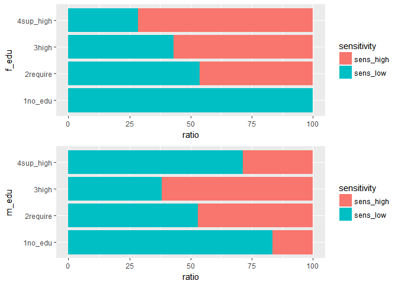

각각 보자면, 먼저 어머니의 학력에 따른 민감도 비율이다. 무학인 어머니를 둔 여성과 석,박사 이상의 학력을 가진 어머니를 둔 여성들이 민감도가 상대적으로 낮은 수가 많았다. 다음으로는 아버지의 학력에 따른 것인데, 마찬가지로 무학인 아버지를 둔 여성들은 모두 sens\_low로 분류되었지만 석,박사 이상의 학력에서는 반대의 양상을 보였다. 종합적으로 보면 부모님의 학력수준이 높아짐에 따라 성폭력 인식이 높다고 분류되는 여성도 많아졌다고 할 수 있다. 따라서 독립변수인 성폭력 민감도가 형성되는 과정에 영향을 주는 데이터를 찾았다고 말할 수 있다.

#### 4.2.2. 15세 무렵 경제적 형편이 성폭력 민감도에 미치는 영향

``` r
#성폭력 민감도를 기준으로 경제적 형편 분포 알아보기
gender_sens_eco <- data %>%
  group_by(sensitivity, eco) %>%
  summarise(n = n()) %>% 
  mutate(ratio = (n/sum(n))*100)

gender_sens_eco
```

    ## # A tibble: 9 x 4
    ## # Groups:   sensitivity [2]
    ##   sensitivity   eco     n  ratio
    ##   <chr>       <dbl> <int>  <dbl>
    ## 1 sens_high      1.     4  2.38 
    ## 2 sens_high      2.    25 14.9  
    ## 3 sens_high      3.   106 63.1  
    ## 4 sens_high      4.    33 19.6  
    ## 5 sens_low       1.     9  5.49 
    ## 6 sens_low       2.    18 11.0  
    ## 7 sens_low       3.   105 64.0  
    ## 8 sens_low       4.    31 18.9  
    ## 9 sens_low       5.     1  0.610

##### - 그래프

``` r
#x축을 성폭력 민감도, y축을 비율(경제적 형편 포함)로 하는 그래프 생성
graph3 <- ggplot(data = gender_sens_eco, aes(x = sensitivity, y = ratio, fill = eco)) + 
  geom_col() + 
  coord_flip()

graph3
```

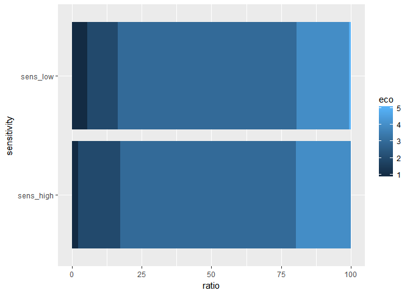

이 변수에 관해서는 성폭력 민감도가 높은 집단, 낮은 집단 간에 큰 차이는 없었으나, 민감도가 높은 집단 중 15세 무렵 집안 형편이 '어려운 편(아주 어려운 편 + 대체로 어려운 편)'이라고 답한 사람의 비율이(약 18%) 민감도가 낮은 집단(약 11%)보다 높았다. 또한, 신기하게도 집안 형편이 '아주 잘사는 편'이라는 사람들의 비율도 민감도가 낮은 집단(0%)보다 높은 집단(약 0.4%)에서 더 높게 나타났다. 결론적으로, 성폭력에 대해 민감도가 낮은 집단의 사람들은 대체로 15세 무렵 경제적 형편이 '보통이었다(약 70%)'는 것을 알 수 있었다.

#### 4.2.3. 15세 무렵 부모님이 성폭력 민감도에 미치는 영향

##### 4.2.3.1. 15세 무렵 부모님과의 관계

``` r
#성폭력 민감도를 기준으로 '부모님과의 관계' 변수 분포 알아보기
gender_sens_p_rel <- data %>%
  group_by(sensitivity, par1) %>%
  summarise(n = n()) %>% 
  mutate(ratio = (n/sum(n))*100)

gender_sens_p_rel
```

    ## # A tibble: 11 x 4
    ## # Groups:   sensitivity [2]
    ##    sensitivity  par1     n ratio
    ##    <chr>       <dbl> <int> <dbl>
    ##  1 sens_high      1.     3  1.79
    ##  2 sens_high      3.     8  4.76
    ##  3 sens_high      4.    62 36.9 
    ##  4 sens_high      5.    84 50.0 
    ##  5 sens_high      6.    11  6.55
    ##  6 sens_low       1.     7  4.27
    ##  7 sens_low       2.     3  1.83
    ##  8 sens_low       3.     3  1.83
    ##  9 sens_low       4.    64 39.0 
    ## 10 sens_low       5.    82 50.0 
    ## 11 sens_low       6.     5  3.05

``` r
#x축을 성폭력 민감도, y축을 비율(부모님과의 관계 포함)로 하는 그래프 생성
graph4_1 <- ggplot(data = gender_sens_p_rel, aes(x = sensitivity, y = ratio, fill = par1)) + 
  geom_col() + 
  coord_flip()

graph4_1
```

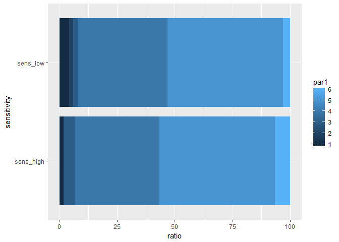

##### 4.2.3.2.1. 15세 무렵 부모님의 양육태도(1)

``` r
#성폭력 민감도를 기준으로 부모님의 양육태도 알아보기
gender_sens_p_att <- data %>%
  group_by(sensitivity, par2) %>%
  summarise(n = n()) %>% 
  mutate(ratio = (n/sum(n))*100)

gender_sens_p_att
```

    ## # A tibble: 7 x 4
    ## # Groups:   sensitivity [2]
    ##   sensitivity  par2     n ratio
    ##   <chr>       <dbl> <int> <dbl>
    ## 1 sens_high      2.    17 10.1 
    ## 2 sens_high      3.   111 66.1 
    ## 3 sens_high      4.    38 22.6 
    ## 4 sens_high      5.     2  1.19
    ## 5 sens_low       2.    23 14.0 
    ## 6 sens_low       3.   114 69.5 
    ## 7 sens_low       4.    27 16.5

##### - 그래프(1)

``` r
#x축을 성폭력 민감도, y축을 비율(부모님의 양육태도 포함)로 하는 그래프 생성
graph4_2 <- ggplot(data = gender_sens_p_att, aes(x = sensitivity, y = ratio, fill = par2)) + 
  geom_col() + 
  coord_flip()

graph4_2
```

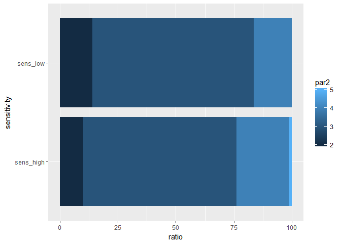

``` r
#부모님과의 관계 관련 그래프와 양육태도 관련 그래프 비교
multiplot(graph4_1, graph4_2, cols = 1)
```

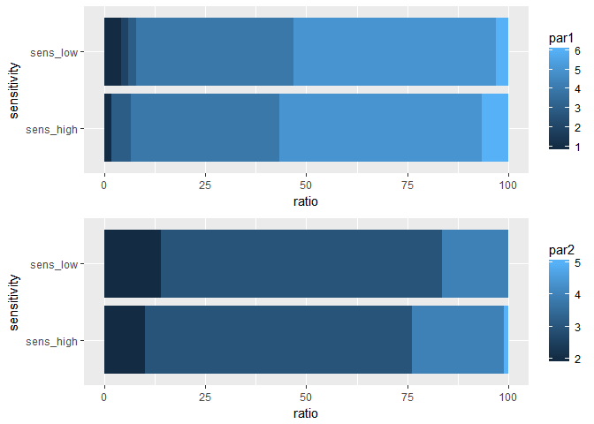

##### 4.2.3.2.2. 15세 무렵 부모님의 양육태도(2)

``` r
#부모님의 양육태도를 기준으로, 성폭력 민감도의 분포 알아보기
gender_sens_p_att <- data %>%
  group_by(par2, sensitivity) %>%
  summarise(n = n()) %>% 
  mutate(ratio = (n/sum(n))*100)

gender_sens_p_att
```

    ## # A tibble: 7 x 4
    ## # Groups:   par2 [4]
    ##    par2 sensitivity     n ratio
    ##   <dbl> <chr>       <int> <dbl>
    ## 1    2. sens_high      17  42.5
    ## 2    2. sens_low       23  57.5
    ## 3    3. sens_high     111  49.3
    ## 4    3. sens_low      114  50.7
    ## 5    4. sens_high      38  58.5
    ## 6    4. sens_low       27  41.5
    ## 7    5. sens_high       2 100.

##### - 그래프(2)

``` r
#x축을 부모님의 양육태도, y축을 비율(성폭력 민감도 포함)로 하는 그래프 생성
graph4_2 <- ggplot(data = gender_sens_p_att, aes(x = par2, y = ratio, fill = sensitivity)) + 
  geom_col() + 
  coord_flip()

graph4_2
```

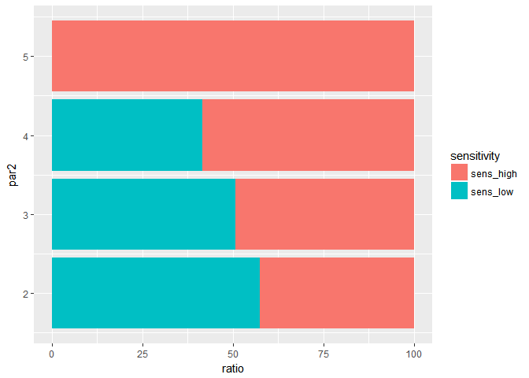

###### - 15세 무렵 부모님과의 관계

그래프를 살펴보았을 때, 두 집단 간 가장 큰 차이는 성폭력 민감도가 큰 집단에서만 '관계가 매우 좋지 않은 편이다'의 응답자가 나타났다는 점이다. 그러나 이는 전체적으로 봤을 때 예외적인 상황이고, 성폭력에 민감한 대부분의 응답자는 부모님과의 관계가 '좋은 편(대체로 좋은 편임(약 52%) + 아주 좋은 편임(약 6%))'이라는 것을 알 수 있다. 위 사실을 바탕으로 유추해보면, 어린 시절 부모님과의 관계가 원만하여 심적으로 여유가 있는 경우 성폭력 등 부정적인 상황에 대해서 민감하고 예민한 태도를 보이는 경향이 있다고 할 수 있다.

###### - 15세 무렵 부모님의 양육태도

성폭력 민감도가 높은 집단과 낮은 집단 간의 가장 큰 차이점은 '부모님의 양육태도가 전혀 엄격하지 않은 편'이라고 응답한 사람(약 0.7%)이 성폭력 민감도가 높은 집단에서만 나왔다는 점이다. 전체 비율 상으로 봤을 때도, 성폭력에 민감도가 높은 집단 중 부모님의 양육태도가 '엄격하지 않은 편(전혀 엄격하지 않은 편(약 0.7%) + 별로 엄격하지 않은 편(약 22%))'이라고 답한 응답자의 비율이 성폭력 민감도가 낮은 집단(약 10%)에 비해 높음을 알 수 있다. 추가 그래프를 보더라도, 결론적으로 15세 무렵 부모님의 양육태도가 엄격하지 않으면, 자녀의 성적 가치관이 민감하고 냉철함을 유추할 수 있다.

#### 4.2.4. 부부생활 중 성적 만족도가 성폭력 민감도에 미치는 영향

``` r
#성생활 만족도를 기준으로, 성폭력 민감도 분포 알아보기
sens_sat <- data %>%
  group_by(satis, sensitivity) %>%
  summarise(n=n()) %>%
  mutate(ratio = (n/sum(n))*100)

sens_sat
```

    ## # A tibble: 8 x 4
    ## # Groups:   satis [4]
    ##   satis sensitivity     n ratio
    ##   <dbl> <chr>       <int> <dbl>
    ## 1    1. sens_high       2  33.3
    ## 2    1. sens_low        4  66.7
    ## 3    2. sens_high      25  43.1
    ## 4    2. sens_low       33  56.9
    ## 5    3. sens_high     112  49.1
    ## 6    3. sens_low      116  50.9
    ## 7    4. sens_high      29  72.5
    ## 8    4. sens_low       11  27.5

##### - 그래프

``` r
#x축을 성생활 만족도, y축을 비율(성폭력 민감도 포함)로 하는 그래프 생성
graph6 <- ggplot(data = sens_sat, aes(x = satis, y = ratio, fill = sensitivity)) + 
  geom_col() +
  coord_flip()

graph6
```

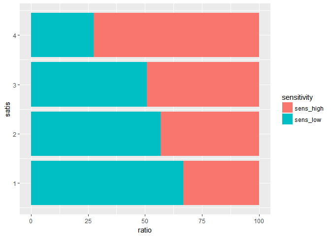

graph6 에서 성생활을 높은 가치를 둘 수록 성폭력 민감도가 높다는 것을 알 수 있다. 성 생활의 중요도를 높게 부여하는 집단에서는 성폭력 민감도가 높은 사람들의 분포가 높았다. 매우그렇다(4) 라고 응답한 사람들 중 성폭력 민감도가 높은 사람이 72.5%, 조금 그렇다(3) 라고 응답한 사람들 중 성폭력 민감도가 높은 사람이 49.1%, 그렇지 않다(2) 라고 응답한 사람들 중에서 성폭력 민감도가 높은 사람이 43.1%, 마지막으로 그렇지 않다(1) 라고 응답한 사람들 중에서 성폭력 민감도가 높은 사람이 33.3% 라는 점에서 앞선 결론을 도출할 수 있다. 즉 성 생활에 대한 가치 중요도는 성폭력 민감도와 비례관계를 나타냄을 알 수 있다.

### 4.3. 추가분석 - 성폭력 민감도에 따른 경제적 결정권 인식

``` r
#성폭력 민감도를 기준으로 경제적 결정권 인식 분포 알아보기
sens_dec <- data %>%
  group_by(sensitivity, dec) %>%
  summarise(n = n()) %>%
  mutate(ratio = n/sum(n)*100)

sens_dec
```

    ## # A tibble: 8 x 4
    ## # Groups:   sensitivity [2]
    ##   sensitivity   dec     n  ratio
    ##   <chr>       <dbl> <int>  <dbl>
    ## 1 sens_high      1.     1  0.595
    ## 2 sens_high      2.     3  1.79 
    ## 3 sens_high      3.   100 59.5  
    ## 4 sens_high      4.    64 38.1  
    ## 5 sens_low       1.     1  0.610
    ## 6 sens_low       2.    24 14.6  
    ## 7 sens_low       3.   108 65.9  
    ## 8 sens_low       4.    31 18.9

#### - 그래프

``` r
#x축을 성폭력 민감도, y축을 비율(경제적 결정권 인식 포함)로 하는 그래프 생성
graph5 <- ggplot(data = sens_dec, aes(x = sensitivity, y = ratio, fill = dec)) +
  geom_col() +
  coord_flip()

graph5
```

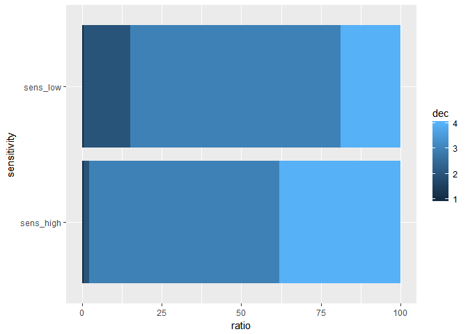

성폭력 민감도와 경제적 결정권 주체 인식에 관해서 전반적인 전개 양상은 남자가 경제적 결정권을 가지는 것에 ‘조금 그렇다’로 답한 사람들이 가장 많고, ‘별로 그렇지 않다’, ‘매우 그렇다’가 그 뒤를 따르며, ‘전혀 그렇지 않다’가 가장 낮은 것으로 나타났다. 질문 자체가 남녀가 경제적 결정권을 분배하는 것을 묻는 것이 아니라, 남자가 결정권을 가져야 하는지를 묻고 있으므로, ‘전혀 그렇지 않다’에 답한 사람과 ‘별로 그렇지 않다’에 답한 사람들이 경제적 결정권을 어떻게 나누어야 하는지는 알 수 없다. 그러나, ‘매우 그렇다’의 경우, 남자가 경제적 결정권의 주체가 되어야 한다고 생각하는 것이므로, 그 항목을 통해 비교하도록 한다. 성폭력 민감도가 높은 사람들은 경제적 결정권을 남자가 가져야한다고 생각하는 비중이 약 1%이고, 성폭력민감도가 낮은 사람들의 경우, 약 2.44%로 나타났다. 이를 통해, 성폭력민감도가 높은 사람들이 남자가 경제적 결정권의 주체가 되는 것을 반대하는 성향도 더 높다는 것을 알 수 있었다.

### 4.4 결론

성폭력 민감도는 성역할 인식 등 성 관련 인식과 상호작용을 한다고 볼 수 있다. 성폭력 민감도가 높을 수록 성역할에 대한 구분을 적게 하였으며, 경제적 결정권에서 남성 주도의 결정에 대해 반대하는 성향을 보였다. 그러한 성폭력 민감도는 성장배경과, 개인의 성생활에 대한 인식에 영향을 받아 형성됨을 알 수 있었다. 특히, 성폭력 민감도가 낮게 형성되는 원인은 부모님의 낮은 학력, 원만하지 않은 부모님과의 관계, 부모님의 엄격한 양육태도와 같은 성장배경이 있었다. 또한 개인이 성생활에 대해 중요하게 인식하지 않을수록 성폭력 민감도가 낮게 형성되는 원인으로 나타났다. 현대 대한민국 사회는 양성평등 의식이 확산이 이루어지고 있으며 그에 따라 성역할을 구분하는 행위나 남성 주도의 경제적 결정과 같은 부분에서 갈등을 겪고 있다. 성폭력 민감도는 이러한 문제와 비례하는 관계에 놓여있다. 한국 사회 내에서 앞서 말한 문제를 해결하기 위해서는 양성 평등 인식을 확산시키고, 성폭력 민감도를 높이는 방향으로 나아가야 할 것이다. 본 연구를 통해 알게 된 성폭력 민감도에 관한 원인 부분에서의 개선과 같은 노력 등이 필요할 것이다.

5.논의
------

### 5.1. 한계점 및 비판점향

#### 5.1.1. 변수 분류 기준의 모호함

##### <sensitivity 기준 선정>

###### - 방식 1

``` r
#성폭력 민감도 변수 전처리 과정(4번에 응답한 경우만을 사용했을 때)
data <- data %>%
  mutate(sens_std = 0,
         sens_std = ifelse(var3 == 4, sens_std + 1, sens_std),
         sens_std = ifelse(var4 == 4, sens_std + 1, sens_std),
         sens_std = ifelse(var5 == 4, sens_std + 1, sens_std),
         sens_std = ifelse(var6 == 4, sens_std + 1, sens_std),
         sens_std = ifelse(var7 == 4, sens_std + 1, sens_std),
         sens_std = ifelse(var4 == 4, sens_std + 1, sens_std),
         sensitivity_1 = ifelse(sens_std >=2, "sens_high", "sens_low"),
         sensitivity_2 = ifelse(sens_std >=3, "sens_high", "sens_low"),
         sensitivity_3 = ifelse(sens_std >=4, "sens_high", "sens_low"),
         sensitivity_4 = ifelse(sens_std >=5, "sens_high", "sens_low"),
         sensitivity = sensitivity_4)
table(data$sensitivity_1)
```

    ## 
    ## sens_high  sens_low 
    ##       239        93

``` r
table(data$sensitivity_2)
```

    ## 
    ## sens_high  sens_low 
    ##       218       114

``` r
table(data$sensitivity_3)
```

    ## 
    ## sens_high  sens_low 
    ##       196       136

``` r
table(data$sensitivity_4)
```

    ## 
    ## sens_high  sens_low 
    ##       152       180

성폭력 민감도에 대해 높은 집단과 낮은 집단을 구분하는 기준은 본 분석에서 굉장히 중요한 요소였다. 그 비율이 균등하지 않으면 결론 도출에 있어서 빈도가 적어 결론을 도출하는 과정에서 적은 빈도의 항목으로 상관관계를 일반화를 시키는 오류를 범할 수 있기 때문이다. 이를 고려하여 높은 집단과 낮은 집단을 균등하게 분류하는 방식을 찾고자 하였다. 방식 1번은 4번에 응답을 한 횟수에 관한 sens\_std라는 변수를 기준으로 성폭력 민감도를 높고 낮음으로 분류한 것이다. 하지만 이 방식의 경우 높은 집단과 낮은 집단의 비율을 5:5로 조정하는데에 어려움을 느껴 성폭력 민감도의 수치를 세분화 시킬 필요성을 느꼈다.

###### 방식 2 : 수치 세분화

``` r
#성폭력 민감도 변수 전처리 과정(점수 기준을 2, 3, 4, 5로 했을 때의 결과)
data <- data %>%
  mutate(sens_std = 0,
         sens_std = ifelse(var3 == 4, sens_std + 1, sens_std),
         sens_std = ifelse(var4 == 4, sens_std + 1, sens_std),
         sens_std = ifelse(var5 == 4, sens_std + 1, sens_std),
         sens_std = ifelse(var6 == 4, sens_std + 1, sens_std),
         sens_std = ifelse(var7 == 4, sens_std + 1, sens_std),
         sens_std = ifelse(var8 == 4, sens_std + 1, sens_std),
         sens_std = ifelse(var3 == 3, sens_std + 0.5, sens_std),
         sens_std = ifelse(var4 == 3, sens_std + 0.5, sens_std),
         sens_std = ifelse(var5 == 3, sens_std + 0.5, sens_std),
         sens_std = ifelse(var6 == 3, sens_std + 0.5, sens_std),
         sens_std = ifelse(var7 == 3, sens_std + 0.5, sens_std),
         sens_std = ifelse(var8 == 3, sens_std + 0.5, sens_std),
         sensitivity_1 = ifelse(sens_std >=2, "sens_high", "sens_low"),
         sensitivity_2 = ifelse(sens_std >=3, "sens_high", "sens_low"),
         sensitivity_3 = ifelse(sens_std >=4, "sens_high", "sens_low"),
         sensitivity_4 = ifelse(sens_std >=5, "sens_high", "sens_low"))
table(data$sensitivity_1)
```

    ## 
    ## sens_high  sens_low 
    ##       318        14

``` r
table(data$sensitivity_2)
```

    ## 
    ## sens_high  sens_low 
    ##       288        44

``` r
table(data$sensitivity_3)
```

    ## 
    ## sens_high  sens_low 
    ##       224       108

``` r
table(data$sensitivity_4)
```

    ## 
    ## sens_high  sens_low 
    ##       168       164

방식 2는 방식 1보다 성폭력 민감도 수치를 세분화 시킨 방식이다. sens\_std 변수를 ‘4번 응답에 대답한 횟수’가 아닌 성폭력 민감도 낮음을 점수화 시킨 변수이다. 즉 sens\_std가 커질수록 성폭력 민감도가 낮다는 것을 의미한다. 점수 산정 방식은 4번으로 대답할 때마다 1점이 추가되고 3번으로 대답할 경우에는 0.5점이 추가되는 방식이다. 이 점수를 기준으로 하여 민감도 집단을 나누었을 때 ‘sens\_std &gt;= 5’ 때 가장 균등한 비율을 나타냈으므로 본 분석에서 이와 같이 민감도 변수를 정의하였다.

#### 5.1.2. 주관적으로 해석될 가능성

본 연구에서 사용된 변수들은 성 관련 ‘인식’에 대한 변수들이다. 따라서, 응답자의 경우, 답변할 때 각각이 생각한 척도가 다른 의미를 가질 수 있고, 해석하는 사람의 경우에도 다양한 관점에서 해석할 수 있다는 한계를 지닌다. 이를 테면, 15세 이전 성장 배경 중 경제적 형편과 관련된 변수의 응답은 ‘아주 잘 사는 편이었다’, ‘대체로 잘 사는 편이었다’, ‘대체로 어려운 편이었다’, 등 객관적인 수치(소득 총액 등)가 아닌 주관적인 인식을 통해 조사되었는데, 이는 ‘잘 사는 정도’가 각 개인에 따라 다르게 인식될 수 있기에, 다양하게 해석될 여지를 남긴다. 또한 이러한 변수는 결과에도 영향을 미치게 된다. 본 연구를 통해 대략적인 결과는 알 수 있지만, 정확한 소득 총액에 따른 인식을 비교할 수는 없다. 이외에도, 부모님과의 관계, 양육태도, 성생활 만족도, 경제적 결정권의 주체에 관한 인식 등 대부분의 변수가 인식과 관련된 변수이기 때문에, 다양하게 해석될 여지가 있다. 이는 추후 분석을 통해 개선되어야 할 것이다.

#### 5.1.3. 데이터 특성

본 연구에서 사용한 데이터에서 사용한 변수들의 답변이 세분화되어 있는 것이 많아서 응답자 수 균형이 맞는 변수를 찾기 어려웠다. 이에 따라 그래프를 그려보니 가설 검증에 어려움이 있어 분석에 난항을 겪었다. 비율을 통해 해석한 것을 보고 일반화의 오류를 범했다고 비판받을 수 있다. 실례로 부모의 학력수준을 답하는 데 무학인 부모를 둔 여성은 총 9명 석박사 이상의 학력의 부모를 둔 여성은 총 21명 이었다. 더 유의미한 가설 검증을 위해서는 응답이 고른 적절한 데이터가 필요하다.

### 5.2. 추후 분석 방향

#### 5.2.1. 객관성 확보를 위한 연구

앞서 논한 논의점 또는 한계점에서 공통적으로 발견된 문제는 객관성의 결여이다. 유효한 가설 검증을 위해서는 데이터의 객관성과 객관적으로 해석하는 방법을 채택하는 방식의 연구를 추가로 구상하는 것이 좋을 것이다.

#### 5.2.2. 인식 개선을 위한 연구

본 연구는 성 관련 인식 전반을 개선하기 위한 연구이기에, 본 연구의 결과에 따라, 정책 수립 등 현실적인 문제 해결을 위한 연구를 진행한다면, 사회 발전에 더 큰 기여를 할 수 있을 것이다.
